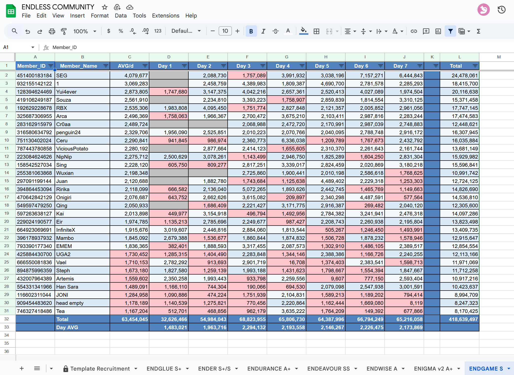

# **📄 Uma Club Tracking — Chronogenesis Exporter (Preview 3.0)**

This project fetches **club friend history data** from [ChronoGenesis](https://chronogenesis.net/)  
and automatically exports it into a **formatted Google Spreadsheet** — complete with borders, totals, averages, and conditional formatting.

**Preview**


For the **Endless** community, place your `credentials.json` file in the same folder, then use the `.exe` from **[Releases](../../releases)** — no further setup needed.

---

## ⚙️ Setup

1. Click the green **Code** button → **Download ZIP**
2. Extract the folder anywhere on your computer
3. Follow this video tutorial to create your Google API credentials:
   ▶️ https://youtu.be/zCEJurLGFRk
   Watch from 1:59 → 6:50 to generate your Service Account key
   Then rename the file to credentials.json and place it in the same folder as main.py
4. Open `globals.py` and edit these values if needed:

```
SHEET_ID = "1O09PM-hYo-H05kWWqMg71GelEpfaGrePQWzdDCKOqyU"

CLUBS = {
"1": {"title": "EndGame", "URL": "https://chronogenesis.net/club_profile?circle_id=endgame", "THRESHOLD": 1800000},
...
}
```

---

## ▶️ Usage

Simply double-click:
'''"Script_run.bat"'''
Then choose:

```

=== Choose a club to export ===

1. EndGame
2. AnotherClub
   ...
3. Export ALL clubs (default)
   Enter 0–7 [default=0]:

```

- Press Enter / 0: export all clubs in parallel
- Enter a number: export a single club only
- Each club will appear as a separate sheet inside your Google Spreadsheet.

---

## 🧾 Export Details

- Header & totals → **bold, white text on blue background**
- Alternating light rows for readability
- Automatic borders around all cells
- Conditional colors:
  - 🔴 **Red** → value below threshold
  - ⚪ **Grey** → blank cell
- `Member_Name` column auto-sized (fits filter icon)
- Adds a **Total** column & row automatically

---

## ⚡ Parallel Mode

Version 3.0 now runs all clubs **asynchronously in parallel**, reducing total runtime from 8× down to roughly 1× overall loading time.

- Each club runs in its own Edge browser instance (via zendriver).
- Expect brief multiple Edge popups — this is normal.

---

## 🧰 Requirements

Install dependencies:

```

pip install -r requirements.txt

```

**You’ll need:**

- Python 3.11+
- Microsoft Edge
- A valid Google Cloud service account with **Sheets API** enabled

---

## 🛠 Build to EXE (Windows)

To bundle everything into one executable:

```

python -m PyInstaller --onefile main.py

```

Output file:

```

dist/main.exe

```

---

## 🪶 Notes

- If you want to change your output Google Sheet, edit `SHEET_ID` in `globals.py`
- The script automatically deletes and recreates each sheet before exporting
- To limit simultaneous exports (for lower-end PCs), you can add a concurrency cap in `main()`


